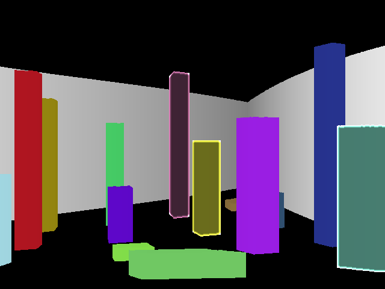

## RayCast Scene
This is a RayCast Project I made in 2018. It renders 3D Prisms (objects with flat top and bottom) by sending rays from the player position in all directions. 

The project supports:
 - prisms with polygonal base
 - different colors
 - different heights

### Resources
- https://lodev.org/cgtutor/raycasting.html
- https://permadi.com/1996/05/ray-casting-tutorial-table-of-contents/
- https://github.com/vinibiavatti1/RayCastingTutorial/wiki

### Controls
In the 2D area you can:
 - left click to set the position
 - right click to set the looking direction
 - middle drag to look around

In the 3D area you can
 - move with W/A/S/D
 - turn to the left and right with Q/E